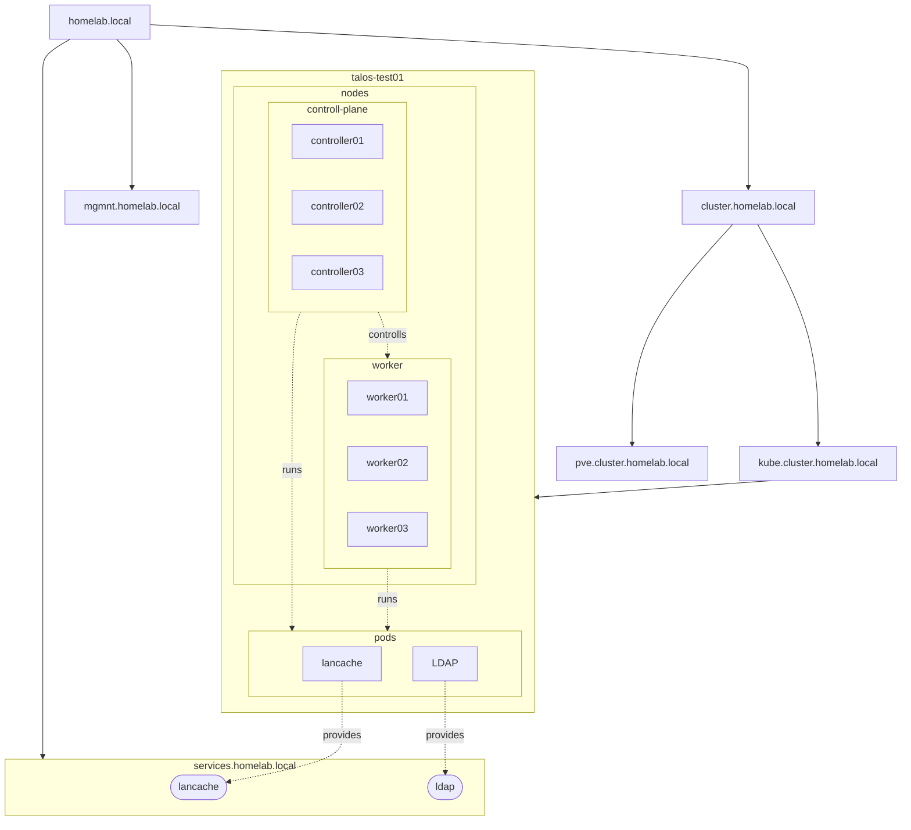

# DNS:
  - homelab.local (root domain)
  - mgmt.homelab.local (everything Managment related)
  - services.homelab.local (for all provided Services)
  - cluster.homelab.local (for all Cluster's)
## Cluster:
  - kube.cluster.homelab.local (for all Kubernetes Cluster)
  - pve.cluster.homelab.local (for all Proxmox VE Cluster)
### Kubernetes Cluster:
  - (worker|controller)NN.talos-test01.kube.cluster.homelab.local (Talos Kubernetes Test Cluster 01)
### Proxmox VE Cluster:
  - <u>**TODO**</u>

# Subnets:
  - 192.168.54.0/23 Services (*.services.homelab.local)
  - 192.168.16.0/23 Managment (*.mgmt.homelab.local)

# VLAN's:
  - 16 Managment
  - 54 Services
  - ?? talos-test01 Cluster Communication

# Services:

  - [ ] Veeam (PVE, local)
  - [ ] LanCache (Kubernetes, local)
  - [ ] LDAP (Kubernetes, local)

# TODO:
  - [ ] everything... 😐
  - [ ] Network
    - [ ] Design
      - [ ] Topologie
      - [ ] VLAN's
      - [ ] Subnet's
      - [ ] Hardware considerations
    - [ ] Config
      - [ ] Router
        - [ ] VLAN's
        - [ ] Subnet's
        - [ ] Firewall
        - [ ] DHCP/DNS
      - [ ] Switche's
        - [ ] VLAN's
        - [ ] Subnet's
    - [ ] Testing
  - [ ] Kubernetes Cluster
    - [ ] talos-test01
      - [ ] Load Balancer configuration
      - [ ] Deploy Services
  - [ ] Proxmox VE Cluster
  - [ ] Backup
    - [ ] Main Server (Veeam)
    - [ ] Secondary Server (backups Main, gets backed up by Main)
    - [ ] Testing
      - [ ] backup of "something" to Main Server
      - [ ] backup of main Server to Secondary 
      - [ ] backup of Secondary Server to main Server
      - [ ] Disaster Recovery of "something"
      - [ ] Disaster Recovery of Secondary Server
      - [ ] Disaster Recovery of Main Server
  - [ ] --placeholder--
  - [ ] --placeholder--
  - [ ] --placeholder--
  - [ ] --placeholder--
  - [ ] --placeholder--
  - [ ] --placeholder--

